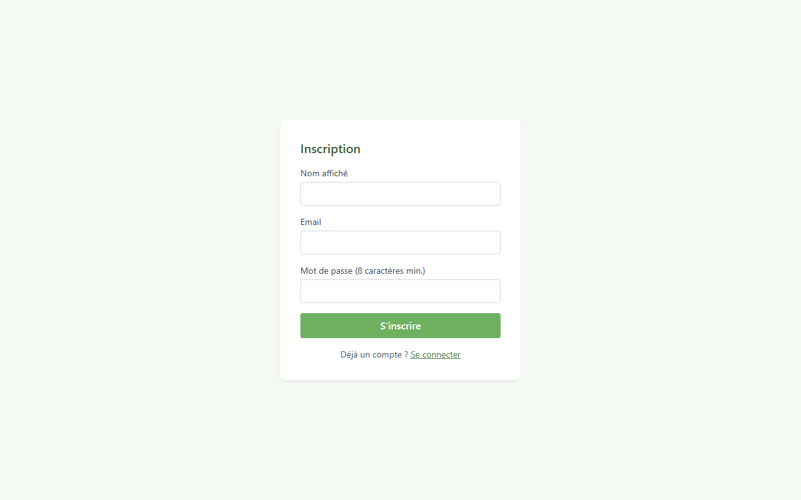
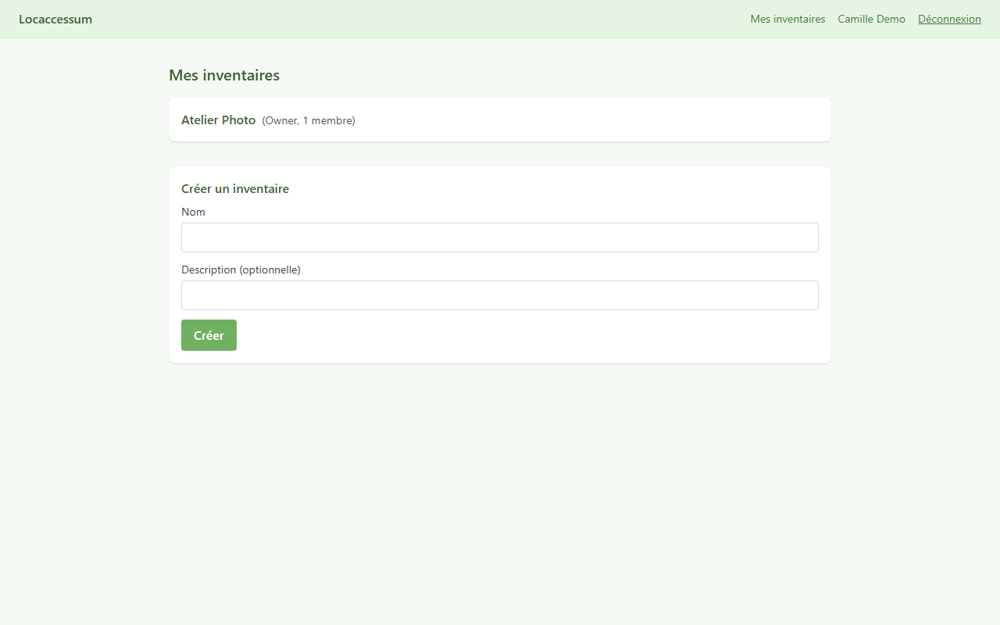
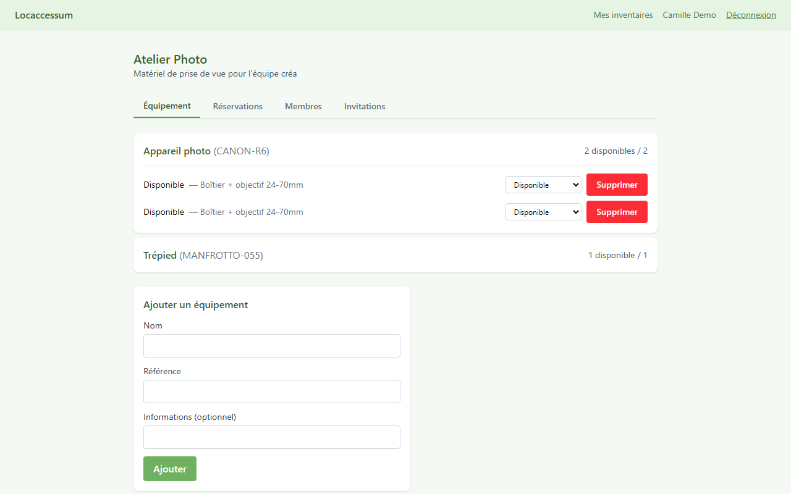
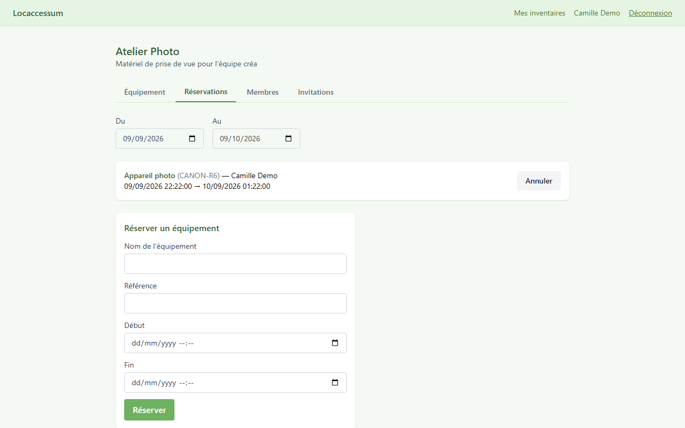
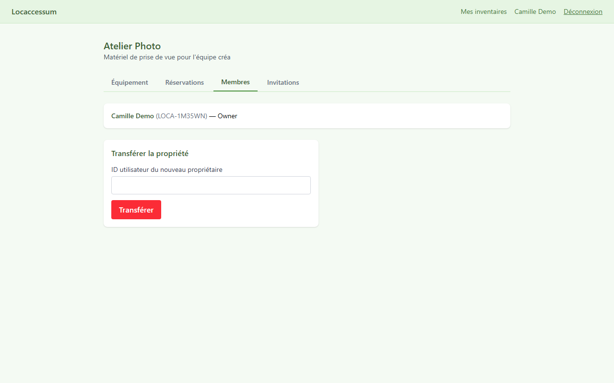

# Locaccessum

Système d'inventaire et de réservation de matériel partagé : s'inscrire, rejoindre un
inventaire, et réserver des unités de matériel sans double réservation.

> ⚠️ **Ceci est une première version, une ébauche encore en cours de développement.** Les trois
> composants (backend, worker, frontend) sont fonctionnels de bout en bout, mais le projet n'est
> pas finalisé — l'interface reste volontairement minimale, et le durcissement production
> (rotation des secrets, TLS, etc.) n'a pas encore été fait.

Ce dépôt contient **le backend, le worker de rappels et le frontend** — une API Web .NET et sa
couche de données, un service Node.js qui envoie des rappels par e-mail, et une application web
React/TypeScript.

## Prérequis

- [Docker Desktop](https://www.docker.com/products/docker-desktop/) (pour `docker compose up`,
  et pour les tests d'intégration de la suite de tests, basés sur Testcontainers)
- [.NET 10 SDK](https://dotnet.microsoft.com/download) (pour compiler/tester en dehors de Docker)

## Démarrage rapide

```bash
cp .env.example .env
docker compose up --build
```

Cette commande construit l'image de l'API, démarre Postgres, attend que Postgres soit signalé
comme sain, applique les migrations EF Core et charge des données de démonstration au démarrage
(environnement de développement uniquement), puis expose l'API sur `http://localhost:8080`.
Vérifiez `GET http://localhost:8080/health` pour obtenir `{"status":"ok"}`.

## Identifiants de démonstration

Deux utilisateurs sont créés dans l'environnement de développement au premier démarrage :

| E-mail | Mot de passe |
|---|---|
| `alice@locaccessum.dev` | `Passw0rd!` |
| `bob@locaccessum.dev` | `Passw0rd!` |

## Lancer la suite de tests

```bash
cd backend
dotnet test
```

Docker doit être en cours d'exécution : la suite de tests d'intégration démarre une vraie
instance Postgres à chaque lancement via [Testcontainers](https://testcontainers.com/).

## Protection anti-double-réservation

La réservation est protégée sur deux niveaux. Lorsqu'une demande de réservation arrive, le
service de réservation ouvre une transaction en base et prend un verrou avisoire Postgres
(`pg_advisory_xact_lock`) basé sur l'identité du stack de matériel (inventaire + nom +
référence), ce qui sérialise les tentatives de réservation concurrentes sur le même stack afin
qu'une seule requête à la fois évalue quelle unité est libre. En filet de sécurité au niveau de
la base — au cas où cette sérialisation serait un jour contournée — une contrainte d'exclusion
GiST sur la table des réservations rejette d'office toute réservation confirmée qui chevauche
une autre sur la même unité de matériel (erreur Postgres `23P01`), que le service de réservation
intercepte et retraduit en "stack complet" plutôt que de laisser remonter une erreur de base de
données.

## Configuration

Variables d'environnement (voir `.env.example`) :

| Variable | Rôle |
|---|---|
| `POSTGRES_USER` / `POSTGRES_PASSWORD` / `POSTGRES_DB` | Identifiants/base du conteneur Postgres |
| `ConnectionStrings__Default` | Chaîne de connexion EF Core (utilisée en dehors de Docker) |
| `Jwt__Issuer` / `Jwt__Audience` / `Jwt__Secret` / `Jwt__LifetimeHours` | Paramètres JWT (durée de vie 8h, pas de rafraîchissement) |
| `InternalApiKey` | Clé d'API pour les endpoints internes du worker de rappels |
| `Cors__FrontOrigin` | Origine CORS autorisée pour le (futur) frontend, par défaut `http://localhost:5173` |
| `SMTP_HOST` | Serveur SMTP pour l'envoi des rappels par e-mail (Mailtrap sandbox par défaut) |
| `SMTP_PORT` | Port du serveur SMTP |
| `SMTP_USER` | Identifiant SMTP (optionnel — vide désactive l'authentification SMTP) |
| `SMTP_PASS` | Mot de passe SMTP (optionnel, utilisé avec `SMTP_USER`) |
| `MAIL_FROM` | Adresse d'expéditeur des e-mails de rappel |
| `REMINDER_WINDOW_HOURS` | Fenêtre (en heures) avant le début d'une réservation pour déclencher le rappel, 24 par défaut |
| `CRON_SCHEDULE` | Expression cron de la planification d'exécution du worker, toutes les heures par défaut |

## Worker de rappels

Le worker de rappels (`worker/`) est un service Node.js/TypeScript qui tourne indépendamment de
l'API. Selon une planification horaire (configurable), il interroge l'API pour les réservations
qui commencent dans la fenêtre à venir (24h par défaut) et envoie un e-mail de rappel à
l'utilisateur concerné, puis marque la réservation comme « rappel envoyé » pour ne pas la
renvoyer. Si un envoi échoue, le worker le journalise et continue sans marquer la réservation,
qui sera automatiquement retentée au passage suivant.

Pour le lancer seul, en dehors de `docker compose up` :

```bash
cd worker
cp .env.example .env
npm install
npm run build && npm start
```

Avec `docker compose up`, c'est `docker-compose.yml` qui injecte des variables nommées dans le
conteneur du worker : la plupart proviennent du `.env` racine (`SMTP_HOST`, `SMTP_PORT`,
`SMTP_USER`, `SMTP_PASS`, `MAIL_FROM`, `REMINDER_WINDOW_HOURS`, `CRON_SCHEDULE`), `API_BASE_URL`
est fixé en dur à `http://api:8080`, et `INTERNAL_API_KEY` est défini à partir de la valeur
`InternalApiKey` du `.env` racine (le même secret partagé que lit l'API).

Point important : `INTERNAL_API_KEY` (worker) doit être **identique** à `InternalApiKey` (API
backend), sinon les appels du worker vers l'API échoueront avec une erreur d'authentification.

Par défaut, le SMTP pointe vers un bac à sable Mailtrap (`sandbox.smtp.mailtrap.io`) — aucun
e-mail réel n'est envoyé aux utilisateurs pendant le développement ; les e-mails sont capturés par
Mailtrap pour inspection.

## Frontend

Le frontend (`frontend/`) est une application monopage (SPA) Vite + React + TypeScript qui
consomme l'API backend. Elle permet de s'inscrire, se connecter, créer et rejoindre des
inventaires, gérer le matériel (avec regroupement automatique des unités identiques en piles),
réserver des unités, consulter et annuler ses réservations, gérer les membres et les invitations
d'un inventaire.

Pour la lancer seule, en dehors de `docker compose up`, contre un backend qui tourne déjà :

```bash
cd frontend
cp .env.example .env
npm install
npm run dev
```

L'application est alors disponible sur `http://localhost:5173`.

Avec `docker compose up`, le frontend est construit dans une image Docker multi-étage (build
Vite puis service statique via `nginx:alpine`) et exposé sur le port `5173`. L'URL de l'API
(`VITE_API_BASE_URL`) est figée au moment de la construction de l'image — c'est le modèle de Vite
pour les variables d'environnement statiques — à `http://localhost:8080`, c'est-à-dire l'adresse
vue par le navigateur de l'utilisateur, pas l'adresse interne au réseau Docker utilisée par le
worker.

Le frontend est volontairement simple : thème Tailwind vert pastel, pas d'effets client lourds
(pas d'animations complexes, pas de gestion d'état globale au-delà du contexte d'authentification),
conformément aux objectifs de conception du plan.

### Captures d'écran

| Inscription | Tableau de bord |
|---|---|
|  |  |

| Équipement (avec stacking) | Réservations |
|---|---|
|  |  |

| Membres |
|---|
|  |

---

<!-- English version below -->

# Locaccessum

Shared-equipment inventory and booking system: register, join an inventory, and reserve
equipment stacks without double-booking.

> ⚠️ **This is an early version, a draft still under active development.** All three components
> (backend, worker, frontend) work end to end, but the project isn't finished — the UI stays
> intentionally minimal, and production hardening (secret rotation, TLS, etc.) hasn't been done
> yet.

This repository contains **the backend, the reminder worker, and the frontend** — a .NET Web API
and its data layer, a Node.js service that sends e-mail reminders, and a React/TypeScript web
app.

## Prerequisites

- [Docker Desktop](https://www.docker.com/products/docker-desktop/) (for `docker compose up`, and for
  the test suite's Testcontainers-based integration tests)
- [.NET 10 SDK](https://dotnet.microsoft.com/download) (for building/testing outside of Docker)

## Quick start

```bash
cp .env.example .env
docker compose up --build
```

This builds the API image, starts Postgres, waits for Postgres to report healthy, applies EF Core
migrations and seeds demo data on startup (development environment only), and exposes the API on
`http://localhost:8080`. Check `GET http://localhost:8080/health` for `{"status":"ok"}`.

## Seeded demo credentials

Two users are seeded in the Development environment on first run:

| Email | Password |
|---|---|
| `alice@locaccessum.dev` | `Passw0rd!` |
| `bob@locaccessum.dev` | `Passw0rd!` |

## Running the test suite

```bash
cd backend
dotnet test
```

Docker must be running: the integration test suite spins up a real Postgres instance per test run
via [Testcontainers](https://testcontainers.com/).

## Anti-double-booking protection

Booking is protected in two layers. When a reservation request comes in, the booking service opens
a database transaction and takes a Postgres advisory lock (`pg_advisory_xact_lock`) keyed on the
equipment stack's identity (inventory + name + reference), which serializes concurrent booking
attempts against the same stack so only one request at a time evaluates which unit is free. As a
database-level backstop — in case that serialization is ever bypassed — a GiST exclusion constraint
on the reservations table rejects any overlapping, confirmed reservation for the same equipment unit
outright (Postgres error `23P01`), which the booking service catches and reports back as the stack
being full rather than surfacing a database error.

## Configuration

Environment variables (see `.env.example`):

| Variable | Purpose |
|---|---|
| `POSTGRES_USER` / `POSTGRES_PASSWORD` / `POSTGRES_DB` | Postgres container credentials/database |
| `ConnectionStrings__Default` | EF Core connection string (used when running the API outside Docker) |
| `Jwt__Issuer` / `Jwt__Audience` / `Jwt__Secret` / `Jwt__LifetimeHours` | JWT auth settings (8h lifetime, no refresh) |
| `InternalApiKey` | API key for the internal reminder-worker endpoints |
| `Cors__FrontOrigin` | Allowed CORS origin for the (future) frontend, default `http://localhost:5173` |
| `SMTP_HOST` | SMTP server for sending reminder e-mails (Mailtrap sandbox by default) |
| `SMTP_PORT` | SMTP server port |
| `SMTP_USER` | SMTP username (optional — empty disables SMTP authentication) |
| `SMTP_PASS` | SMTP password (optional, paired with `SMTP_USER`) |
| `MAIL_FROM` | Sender address for reminder e-mails |
| `REMINDER_WINDOW_HOURS` | Hours-ahead window before a reservation start to trigger the reminder, default 24 |
| `CRON_SCHEDULE` | Cron expression for the worker's run schedule, hourly by default |

## Reminder worker

The reminder worker (`worker/`) is a standalone Node.js/TypeScript service. On an hourly schedule
(configurable), it polls the API for reservations starting within the upcoming window (24h by
default) and sends a reminder e-mail to the corresponding user, then marks the reservation as
"reminder sent" so it isn't resent. If a send fails, the worker logs it and moves on without
marking the reservation, which is retried automatically on the next run.

To run it standalone, outside of `docker compose up`:

```bash
cd worker
cp .env.example .env
npm install
npm run build && npm start
```

With `docker compose up`, `docker-compose.yml` injects specific named variables into the worker
container: most come from the root `.env` (`SMTP_HOST`, `SMTP_PORT`, `SMTP_USER`, `SMTP_PASS`,
`MAIL_FROM`, `REMINDER_WINDOW_HOURS`, `CRON_SCHEDULE`), `API_BASE_URL` is hardcoded to
`http://api:8080`, and `INTERNAL_API_KEY` is set from the root `.env`'s `InternalApiKey` value
(the same shared secret the API reads).

Important: `INTERNAL_API_KEY` (worker) must **match** `InternalApiKey` (backend API) exactly, or
the worker's calls to the API will fail authentication.

By default, SMTP points at a Mailtrap sandbox (`sandbox.smtp.mailtrap.io`) — no real e-mails are
sent to users during development; e-mails are captured by Mailtrap for inspection.

## Frontend

The frontend (`frontend/`) is a Vite + React + TypeScript single-page app that consumes the
backend API. It supports registering, logging in, creating and joining inventories, managing
equipment (with automatic stacking of identical units), reserving units, viewing and cancelling
reservations, and managing an inventory's members and invitations.

To run it standalone, outside of `docker compose up`, against an already-running backend:

```bash
cd frontend
cp .env.example .env
npm install
npm run dev
```

The app is then available at `http://localhost:5173`.

With `docker compose up`, the frontend is built as a multi-stage Docker image (a Vite build,
then served statically via `nginx:alpine`) and exposed on port `5173`. The API URL
(`VITE_API_BASE_URL`) is baked in at image build time — per Vite's static-env-var model — as
`http://localhost:8080`, i.e. the address as seen by the user's browser, not the Docker-network-
internal address the worker uses.

The frontend is intentionally simple: a pastel-green Tailwind theme, no heavy client-side effects
(no complex animations, no global state management beyond the auth context), per this plan's
design goals.

### Screenshots

| Register | Dashboard |
|---|---|
|  |  |

| Equipment (with stacking) | Reservations |
|---|---|
|  |  |

| Members |
|---|
|  |
